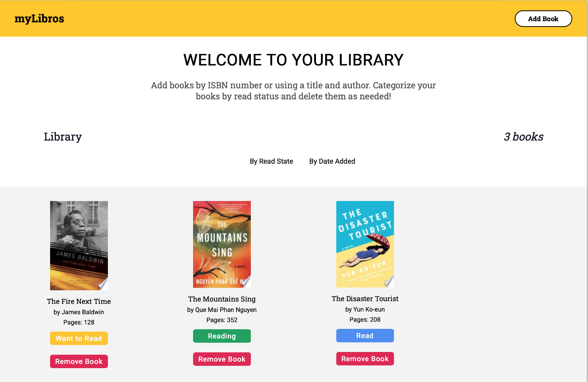

# myLibros

myLibros allows you to catalog your personal library online. Keep track of books 
you have read, are reading or want to read. myLibros uses the Google Books API
to find and add books to your library.

[Link to live project](https://heyitsdiego.github.io/library/)

## Preview

## Features
* Add books
* Categorize books by read status
* Delete books

## Built With
* HTML
* CSS
* Vanilla Javascript